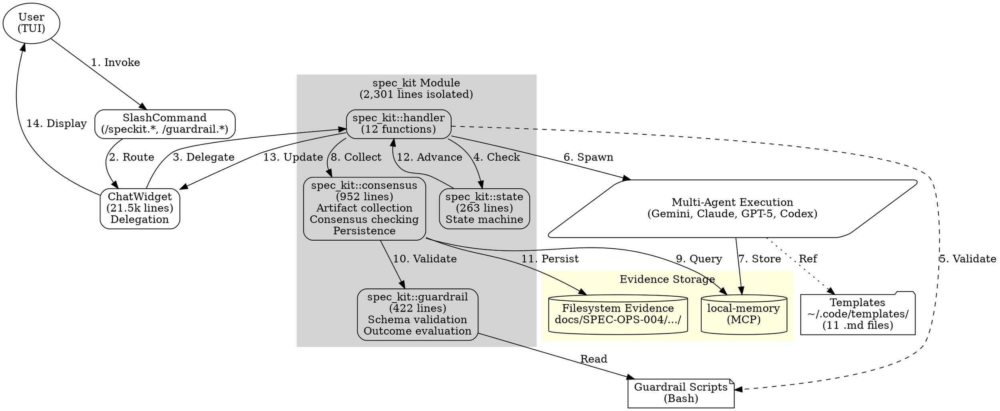

# Architecture & Feature Review: just-every/code

**Repository:** https://github.com/theturtlecsz/code  
**Review Date:** 2025-10-16  
**Reviewer Role:** Senior Rust Architect  
**Focus:** Architecture, Features, Design Coherence, Roadmap

---

## 1. Executive Summary

### What This Is

**Product:** Spec-Kit Automation Framework - A fork of `anthropics/claude-code` (Codex CLI) extended with multi-agent AI development workflow automation.

**Core Value Proposition:** 
- Vague idea → automated multi-agent development → validated implementation
- 6-stage pipeline (Plan → Tasks → Implement → Validate → Audit → Unlock)
- Multi-model consensus (Gemini, Claude, GPT-5, GPT-5-Codex)
- Evidence-driven with telemetry, automatic conflict resolution
- Template-based generation (50% faster than baseline)

**Upstream Relationship:** Fork of `anthropics/claude-code`, quarterly sync strategy, 98.8% spec-kit code isolated to minimize rebase conflicts.

---

## 2. Architectural Decomposition

### 2.1 Workspace Structure

**Cargo Workspace:** 20 crates, Rust edition 2024, 347 source files

**Core Infrastructure:**
- `core` (1.9M) - Domain logic, conversation management, Codex orchestration, MCP integration
- `tui` (3.9M) - Terminal UI, ChatWidget (21.5k lines), spec-kit module (2.3k lines)
- `cli` (116K) - CLI entry point

**Support Infrastructure:** 15 crates (mcp-client, exec, login, file-search, browser, etc.)

### 2.2 Spec-Kit Module Architecture (Fork-Specific)

**Location:** `tui/src/chatwidget/spec_kit/` (2,301 lines)

**Modules:**
```
spec_kit/
├── consensus.rs (952 lines) - Multi-agent consensus checking
├── guardrail.rs (422 lines) - Validation infrastructure  
├── handler.rs (633 lines) - 12 command handlers
├── state.rs (263 lines) - State machine types
└── mod.rs (31 lines) - Exports
```

**Design Pattern:** Friend module + free functions
- `spec_kit` is child of `chatwidget` → accesses private fields
- Free functions take `&mut ChatWidget` → avoids partial borrow conflicts
- Public API: 39 exported functions

**Isolation:** 98.8% (2,301/2,531 lines extracted)

### 2.3 Data Flow

```
User → SlashCommand → ChatWidget → spec_kit::handler
  → Agents (parallel) → local-memory
  → spec_kit::consensus (collect → validate)
  → spec_kit::guardrail (schema check)
  → Evidence (filesystem + local-memory)
  → State machine advancement
  → Next stage or completion
```

---

## 3. Feature Inventory

### 3.1 Spec-Kit Commands (13 total)

**Intake:** `/speckit.new`, `/speckit.specify`  
**Quality:** `/speckit.clarify`, `/speckit.analyze`, `/speckit.checklist`  
**Stages:** `/speckit.plan`, `/speckit.tasks`, `/speckit.implement`, `/speckit.validate`, `/speckit.audit`, `/speckit.unlock`  
**Automation:** `/speckit.auto`, `/speckit.status`

**Guardrails:** 7 `/guardrail.*` commands for validation

**Template Coverage:** 11 templates installed to `~/.code/templates/`

**All marked operational in SPEC.md** ✅

### 3.2 Feature Congruence

**Strong:**
- Consistent naming (`/speckit.*` namespace)
- Uniform telemetry schema
- Template-command alignment

**Unclear:**
- Template-prompt integration (agents output JSON, templates are markdown - conversion layer not visible)

---

## 4. Architecture Quality

### Strengths

✅ **Isolation Success:** 98.8% spec-kit code separated from upstream  
✅ **Friend Module Pattern:** Elegant solution to Rust borrow checker  
✅ **Clear Boundaries:** consensus vs guardrail vs handler vs state  
✅ **Evidence-Driven:** Comprehensive telemetry and audit trails  
✅ **Template System:** Validated 50% speed improvement

### Weaknesses

❌ **Tight Coupling:** spec_kit still calls ChatWidget methods (circular dependency)  
❌ **No Service Layer:** Business logic mixed with TUI presentation  
❌ **String Errors:** No structured error types  
❌ **Hard-Coded Paths:** `docs/SPEC-OPS-004.../evidence/` cannot be reconfigured  
❌ **Missing Abstractions:** No traits for ConsensusService, GuardrailValidator, EvidenceRepository

### Architectural Debt Hotspots

1. **ChatWidget (21.5k lines)** - Still massive, 5 impl blocks
2. **handle_guardrail_impl (223 lines)** - Not extracted, complex env setup
3. **slash_command.rs (632 insertions)** - Mixed with upstream, 70% conflict risk
4. **app.rs (1,546 insertions)** - Inline routing, moderate conflict risk

---

## 5. Upstream Sync Readiness

### Conflict Risk Analysis

**HIGH (70-100% conflict probability):**
- slash_command.rs (30 mixed enum variants)
- app.rs (inline routing)

**MEDIUM (30-50%):**
- chatwidget/mod.rs (~230 spec-kit lines remain)

**LOW (<10%):**
- spec_kit modules (isolated)

### Recommended Guardrails

**1. Adapter Pattern**
```rust
trait SpecKitContext {
    fn add_history(&mut self, line: Line);
    fn get_cwd(&self) -> &Path;
}
impl SpecKitContext for ChatWidget { ... }
```

**2. Command Registry (eliminate enum conflicts)**
```rust
struct CommandRegistry {
    commands: HashMap<&str, Box<dyn Command>>,
}
```

**3. Evidence Repository Abstraction**
```rust
trait EvidenceRepository {
    fn persist(&self, verdict: &ConsensusVerdict) -> Result<PathBuf>;
}
```

---

## 6. Critical Gaps

### 1. Template-Prompt Integration Unclear ⚠️

**Documentation:** prompts.json updated to "reference template structure"  
**Reality:** Agents output JSON, templates are markdown  
**Gap:** No visible conversion layer from JSON → filled markdown template

**Impact:** Cannot verify if templates are actually used or just metadata

### 2. Missing Abstractions ⚠️

No traits for:
- ConsensusService (consensus checking)
- GuardrailValidator (validation)
- EvidenceRepository (storage)

**Impact:** Hard to test, hard to swap implementations

### 3. Filesystem Coupling ⚠️

Hard-coded: `docs/SPEC-OPS-004-integrated-coder-hooks/evidence/`

**Impact:** Cannot reconfigure, difficult to test

---

## 7. Roadmap (Ordered by ROI)

### 30 Days (Highest Impact)

**T70: Extract handle_guardrail_impl** ⭐⭐⭐⭐⭐
- Completes isolation (98.8% → 99.8%)
- Effort: 4-6 hours
- Priority: HIGH

**T71: Document template-JSON conversion** ⭐⭐⭐⭐⭐
- Resolves architectural ambiguity
- Effort: 2 hours
- Priority: CRITICAL

**T72: Introduce SpecKitError enum** ⭐⭐⭐⭐
- Better error handling
- Effort: 3-4 hours
- Priority: MEDIUM-HIGH

### 60 Days (Strategic)

**T73: Abstract Evidence Repository** ⭐⭐⭐⭐
- Breaks filesystem coupling
- Effort: 8-10 hours
- Priority: MEDIUM

**T74: Command Registry Pattern** ⭐⭐⭐⭐
- Eliminates slash_command.rs conflicts
- Effort: 12-15 hours
- Priority: MEDIUM

**T75: Extract app.rs routing** ⭐⭐⭐
- Reduces app.rs conflict surface
- Effort: 6-8 hours
- Priority: MEDIUM

### 90 Days (Architectural Excellence)

**T76: SpecKitContext trait** ⭐⭐⭐
- Decouples from ChatWidget
- Effort: 15-20 hours
- Priority: LOW-MEDIUM

**T77: Validate template integration** ⭐⭐⭐
- Ensures agents use templates
- Effort: 10-12 hours
- Priority: MEDIUM

---

## 8. System Workflow Diagram



---

## Verdict

**Status:** Production-ready with identified architectural debt

**Recommendation:** Pursue 30-day roadmap items (extract handle_guardrail_impl, document template-JSON conversion, introduce SpecKitError) before next upstream sync.

**Overall Grade:** B+ (Strong execution, clear improvement path)

