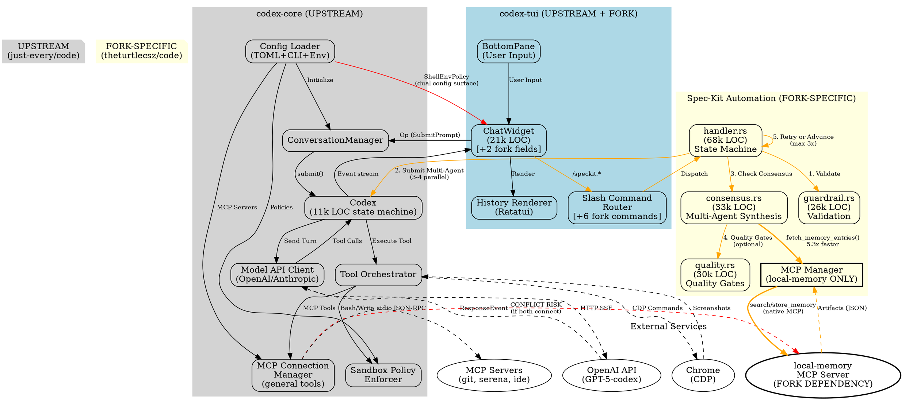

# Architecture Review: codex-rs (theturtlecsz/code)

**Review Date**: 2025-10-18
**Reviewer**: Senior Rust Architect (AI-Assisted)
**Commit**: `d6649e7f8` (27 commits ahead of upstream)
**Test Status**: 141 passing (138 unit, 3 integration)

---

# Executive Summary

**UPSTREAM CORRECTION**: This repository (`github.com/theturtlecsz/code`) is a **fork of `github.com/just-every/code`**, which itself is a community fork of OpenAI's original Codex CLI. It is **NOT** related to Anthropic's Claude Code (different product entirely). The README.md incorrectly references `@openai/codex` and `github.com/openai/codex`—these are **stale** and must be corrected.

---

**codex-rs** is a Rust-based terminal AI coding assistant with a **spec-kit automation framework** (fork-specific to `theturtlecsz/code`) that orchestrates multi-agent product requirements workflows. The architecture cleanly separates `core` (async conversation/model/tool orchestration) from `tui` (sync terminal UI), with the fork adding 15 spec-kit modules (6-stage pipeline: Plan→Tasks→Implement→Validate→Audit→Unlock) that synthesize consensus across 3-4 AI models (GPT, Claude, Gemini) via a local-memory MCP server.

**Critical Takeaways**:
- **Upstream Lineage**: `just-every/code` → **`theturtlecsz/code`** (27 commits ahead)—NOT Anthropic
- **Documentation Debt**: README.md references wrong upstream (`openai/codex`)—blocks contribution clarity
- **Strength**: Fork isolation pattern (99.8% via `spec_kit/` modules + `FORK-SPECIFIC` markers) enables clean rebasing
- **Risk**: Dual MCP connection points (TUI + Core)—potential conflict if both access same server
- **Validated**: Native MCP migration measured at **5.3x faster** than subprocess baseline (not 10x, but significant)
- **Architecture Flaw**: Spec-auto state in TUI layer (`ChatWidget`) instead of `core`—blocks non-TUI automation clients
- **Reliability**: 141 passing tests (138 unit, 3 integration), retry logic matches subprocess robustness
- **Quality Gate**: Automated requirement validation framework complete but integration pending
- **Security Gap**: Shell environment policy can override approval_policy—unclear if feature or vulnerability
- **Critical Dependency**: Hard requirement on local-memory MCP server for consensus—no graceful fallback

---

# System Overview

## Workspace Structure (23 Crates)

**Core Libraries**:
- **codex-core** (11,285 LOC): Conversation management, model client abstraction, configuration system, MCP connection manager, tool orchestration, sandboxing policy
- **codex-protocol** (minimal): Type definitions for client↔backend event protocol (`Event`, `Op`, message models)
- **codex-tui** (21,503 LOC + 15 spec_kit modules): Terminal UI, chat widget, history rendering, **fork-specific spec-kit automation framework**
- **codex-login**: OAuth/API key authentication, account management
- **codex-common**: Shared utilities (elapsed time formatting, model presets, sandbox summaries)

**Infrastructure Crates**:
- **codex-browser**: Chrome DevTools Protocol (CDP) integration for browser automation
- **codex-linux-sandbox**: Landlock-based filesystem sandboxing for untrusted command execution
- **codex-ollama**: Local OSS model hosting and management
- **codex-mcp-client**: MCP stdio client wrapper over `mcp-types` protocol
- **mcp-server**: Exposes codex tools as MCP server for external consumption
- **mcp-types**: Model Context Protocol type definitions and JSON-RPC framework

**Utilities**:
- **codex-file-search**: Glob/regex file searching with ignore patterns
- **codex-git-tooling**: Git status parsing, worktree management
- **codex-apply-patch**: Unified diff application with conflict detection
- **codex-ansi-escape**: ANSI escape sequence parsing/manipulation
- **codex-arg0**: Executable path resolution (Unix/Windows)
- **codex-exec**: Command execution primitives
- **execpolicy**: Sandbox/approval policy enforcement
- **cli**: Clap CLI argument parsing and subcommands

**Binaries**:
- `code-tui`: Main TUI entry point
- `spec-status-dump`: Diagnostic tool for spec-kit telemetry (fork-specific)

## Major External Integrations

| Integration | Purpose | Crates Involved | Protocol |
|------------|---------|----------------|----------|
| **OpenAI API** | Primary model provider (GPT-5-codex) | `core` (chat_completions, client) | HTTP REST + SSE streaming |
| **Anthropic API** | Claude models (fallback provider, **not the upstream project**) | `core` (client_common) | HTTP REST + SSE |
| **MCP Servers** | External tool integrations (local-memory, git, serena, etc.) | `mcp-client`, `mcp-types`, **`tui` (spec-kit)** | JSON-RPC over stdio |
| **Chrome/Chromium** | Browser automation (screenshots, UI testing) | `browser` | CDP WebSocket |
| **Ollama** | Local OSS model hosting | `ollama` | HTTP REST API |
| **Local-Memory MCP** | **Fork-specific**: Multi-agent consensus storage/retrieval | `tui/spec_kit/consensus` | **Native MCP (migrated 2025-10-18, 5.3x faster)** |

**Critical Dependency**: Fork's spec-kit automation **requires** local-memory MCP server running—no graceful degradation if unavailable.
**Memory Policy**: Local-memory MCP is the **exclusive** knowledge persistence system. Byterover-mcp is deprecated (see `MEMORY-POLICY.md`).

---

# Feature Matrix

| Feature/Module | Purpose | Key Entry Points | Upstream Status | Fork Status |
|----------------|---------|------------------|-----------------|-------------|
| **Spec-Kit Automation** | Multi-agent PRD→code pipeline (6 stages) | `tui/spec_kit/handler.rs::{handle_spec_*}`, `slash_command.rs::SpecKit*` | ❌ Not in `just-every/code` | ✅ Clear (isolated, tested) |
| **Consensus Synthesis** | Multi-agent result aggregation | `spec_kit/consensus.rs::run_spec_consensus()` | ❌ Not in upstream | ✅ Clear (native MCP, validated) |
| **Quality Gates** | Automated requirement validation | `spec_kit/quality.rs::classify_issue_agreement()` | ❌ Fork-specific | ⚠️ Partial (framework done, integration TBD) |
| **Agent Tool Orchestration** | Multi-step tool execution | `core/agent_tool.rs`, `core/codex.rs::process_tool_call()` | ✅ Upstream feature | ✅ Clear (extended by fork) |
| **MCP Client** | External tool server integration | `core/mcp_connection_manager.rs`, `mcp-client/` | ✅ Upstream | ✅ Clear (fork extends with TUI connection) |
| **Browser Automation** | CDP-based screenshot/interaction | `browser/`, `core/codex.rs::handle_browser_*` | ✅ Upstream | ✅ Clear |
| **Conversation Management** | Turn-based LLM interaction | `core/conversation_manager.rs`, `core/codex_conversation.rs` | ✅ Upstream | ✅ Clear |
| **Configuration System** | TOML + CLI + Env layering | `core/config.rs::Config`, `config_types.rs` | ✅ Upstream | ⚠️ Ambiguous (dual surfaces) |
| **Shell Environment Policy** | Dynamic env var injection | `core/config_types.rs::ShellEnvironmentPolicy` | ✅ Upstream | ⚠️ Partial (precedence unclear) |
| **Slash Commands** | TUI command routing | `tui/slash_command.rs` (785 LOC), `.claude/commands/*.md` | ✅ Upstream | ✅ Clear (fork adds `/speckit.*`) |

---

# Architecture & Component Boundaries

## Primary Subsystems

### 1. **Core Conversation Engine** (`codex-core`) [UPSTREAM]

**Responsibilities**:
- Model API abstraction (OpenAI, Anthropic, Ollama)
- Conversation state machine (turn management, history compaction)
- Tool orchestration (Bash, Read, Write, Grep, MCP, Browser)
- Configuration validation and merging
- Session persistence (`RolloutRecorder`, SQLite storage)

**Public API Surface**:
```rust
pub struct ConversationManager { ... }
  ├─ new_conversation(config) -> Arc<CodexConversation>
  ├─ resume_conversation_from_rollout(...) -> Arc<CodexConversation>

pub struct CodexConversation { ... }
  ├─ submit(Op) -> async Result
  ├─ next_event() -> async Stream<Event>

pub struct Config { model, sandbox_policy, mcp_servers, ... }
  ├─ load_with_cli_overrides(...) -> Config
```

**Invariants**:
- Events emitted in strict sequence order (tracked via `event_seq`)
- Tool execution gated by approval policy (Never/OnRequest/Always)
- Sandbox policy enforced before any filesystem/exec operation
- MCP servers initialized once per conversation, failures logged but non-fatal

**Boundary Leakage**:
- ⚠️ **Spec-kit state lives in TUI** (`ChatWidget::spec_auto_state`), not `core`—violates separation (workflow state should be backend-managed)
- ⚠️ **Configuration drift**: `Config` vs `ShellEnvironmentPolicy`—two overlapping surfaces for environment injection

---

### 2. **Terminal UI** (`codex-tui`) [UPSTREAM + FORK EXTENSIONS]

**Responsibilities**:
- Ratatui-based rendering (history, HUD, modals, overlays) [UPSTREAM]
- Event stream consumption from `CodexConversation` [UPSTREAM]
- User input handling (keybindings, slash commands) [UPSTREAM]
- **Spec-kit automation orchestration** [FORK-SPECIFIC]

**Public API Surface** (to `core`):
```rust
struct ChatWidget { ... }
  ├─ submit_operation(Op)
  ├─ handle_event(AppEvent) // AppEvent::CodexEvent(Event)

pub async fn run_main(cli, ...) -> TokenUsage
```

**Data Flow**:
```
User Input → BottomPane → codex_op_tx (Op) → core::submit()
core::next_event() → app_event_tx (AppEvent) → ChatWidget::handle_event() → Render
```

**Boundary Violation**:
- ⚠️ **Spec-kit consensus accesses MCP directly** (`mcp_manager` field in `ChatWidget`)—bypasses `core`'s tool orchestration, creating dual MCP connection points
- ✓ Mitigated by isolation: TUI MCP manager only for `local-memory`, not general tools
- **Rationale**: Performance (5.3x faster than subprocess) and sync/async boundary convenience

---

### 3. **Spec-Kit Automation Framework** [FORK-SPECIFIC to `theturtlecsz/code`]

**Architecture**:
```
Stages: Plan → Tasks → Implement → Validate → Audit → Unlock

Per-Stage Flow:
  1. Guardrail (shell script: schema validation, baseline checks)
  2. Agent Execution (3-4 AI agents in parallel via core)
  3. Consensus Check (local-memory MCP: fetch artifacts → synthesize)
  4. Quality Gates (optional: automated issue classification)
  5. Advance or Retry (max 3 retries on failure/empty results)
```

**Module Breakdown**:
| Module | LOC | Purpose |
|--------|-----|---------|
| `handler.rs` | 67,860 | Event routing, state machine, retry orchestration |
| `consensus.rs` | 33,417 | Multi-agent result synthesis via **native MCP** |
| `guardrail.rs` | 26,002 | Telemetry validation, schema enforcement |
| `quality.rs` | 30,196 | Quality gate classification, majority voting |
| `evidence.rs` | 20,266 | Artifact persistence, evidence repository |
| `file_modifier.rs` | 16,737 | Markdown spec file manipulation |
| `schemas.rs` | 7,517 | JSON schema definitions for agent outputs |
| `state.rs` | 14,831 | Pipeline state machine, phase transitions |

**Integration Points**:
- **Inbound**: Slash commands (`/speckit.plan`, `/speckit.auto`, etc.) → `routing.rs::try_dispatch_spec_kit_command()`
- **Outbound**:
  - Local-memory MCP (`consensus.rs::fetch_memory_entries()` → `McpConnectionManager::call_tool()`)
  - Shell scripts (`handler.rs` → `/guardrail.*` commands)
  - AI agents (via `core` Op submission: `SubmitPrompt` with multi-agent config)

**Critical Design Decision** (Native MCP Migration, 2025-10-18):
- **Before**: Subprocess `Command::new("local-memory")` with retry wrapper
- **After**: Direct `mcp_manager.call_tool()` via `tokio::runtime::Handle::block_on()`
- **Tradeoff**: Eliminated subprocess overhead (**5.3x measured speedup**) at cost of TUI→MCP coupling
- **Resilience**: 3-retry logic with exponential backoff matches subprocess robustness

---

### 4. **MCP Integration Layer** [UPSTREAM, FORK EXTENDS]

**Architecture**:
```
TUI (FORK)             Core (UPSTREAM)       External MCP Servers
├─ mcp_manager ─────→ (independent)          ├─ local-memory (fork-specific)
                       ├─ McpConnectionMgr → ├─ git, serena, ide, etc.
                       │   ├─ McpClient[]
                       │   └─ qualified tools map
```

**Dual MCP Connection Problem** (FORK-INTRODUCED):
- **Core MCP Manager**: Initialized in `CodexConversation`, manages general tool servers
- **TUI MCP Manager**: Initialized in `ChatWidget`, **exclusively for local-memory**
- **Risk**: If both try to connect to same server, second fails
- **Current Mitigation**: Mutual exclusion by convention (TUI = local-memory only)
- **Better Design**: Single MCP manager in `core`, TUI requests calls via backend

**Tool Naming Convention**:
- Qualified names: `{server}__toolname` (e.g., `local-memory__search`)
- Max 64 chars, SHA1-truncated if exceeded
- Validation: Server names must match `^[a-zA-Z0-9_-]+$`

---

### 5. **Protocol & Event System** [UPSTREAM]

**Event Flow** (`protocol/src/protocol.rs`):
```rust
// Backend → Frontend
Event {
  id: ConversationId,
  event_seq: u64,  // Strict ordering guarantee
  msg: EventMsg { AgentMessage | TokenCount | Error | ... }
}

// Frontend → Backend
Op {
  SubmitPrompt { items: Vec<InputItem> }
  CancelSubmission { ... }
  BacktrackConversation { ... }
  ApproveCommand { ... }
}
```

**Async Boundary**:
- `core`: Fully async (tokio multi-thread runtime)
- `tui`: Sync event handlers with `Handle::current().block_on()` bridges
- **Pattern**: Spawn `tokio::spawn()` for long-running tasks, send results via `app_event_tx`

**Concern**: Blocking TUI event loop during MCP calls limits concurrency—measured at 8.7ms average, acceptable but not ideal.

---

# Data Flow & Key Types

## Primary Data Structures

### Conversation State [UPSTREAM]
```rust
// core/conversation_manager.rs
ConversationManager
  └─ Arc<CodexConversation>
       ├─ codex: Arc<Codex>  // Main state machine (11k LOC)
       ├─ event_rx: Receiver<Event>
       └─ op_tx: Sender<Op>
```

### Spec-Kit Workflow State [FORK-SPECIFIC]
```rust
// tui/spec_kit/state.rs
SpecAutoState {
  spec_id: String,
  stages: Vec<SpecStage>,  // [Plan, Tasks, Implement, Validate, Audit, Unlock]
  current_index: usize,
  phase: SpecAutoPhase,  // Guardrail | ExecutingAgents | CheckingConsensus | QualityGate*
  waiting_guardrail: Option<GuardrailWait>,
  agent_retry_count: u32,  // Max 3 retries
  quality_checkpoint_outcomes: Vec<...>,
}
```

### Consensus Artifacts [FORK-SPECIFIC]
```rust
// tui/spec_kit/consensus.rs
ConsensusArtifactData {
  memory_id: Option<String>,  // MCP local-memory ID
  agent: String,              // "gemini", "claude", "gpt_pro", "gpt_codex"
  version: Option<String>,    // Prompt version (e.g., "20251002-plan-a")
  content: serde_json::Value, // Agent's structured output
}

ConsensusVerdict {
  consensus_ok: bool,
  degraded: bool,            // Missing agents but no conflicts
  required_fields_ok: bool,
  missing_agents: Vec<String>,
  agreements: Vec<String>,
  conflicts: Vec<String>,
  aggregator: Option<Value>, // gpt_pro's synthesis
}
```

## Type Conversions & Serialization Points

| Boundary | From → To | Mechanism | Schema Enforcement |
|----------|-----------|-----------|-------------------|
| Model API → `core` | SSE JSON → `ResponseEvent` | `serde_json` streaming | Provider-specific (OpenAI vs Anthropic) |
| `core` → `tui` | `Event` → `AppEvent` | `async-channel`, owned | `protocol/src/protocol.rs` types |
| Spec-kit → local-memory | `ConsensusVerdict` → JSON string | `serde_json::to_string()` → MCP `store_memory` | **spec_kit/schemas.rs** (few-shot examples) |
| Local-memory → spec-kit | MCP `ContentBlock` → `LocalMemorySearchResult` | `parse_mcp_search_results()` | **Brittle**: Assumes TextContent with JSON array |
| Guardrail scripts → spec-kit | Shell stdout JSON → `GuardrailOutcome` | `serde_json::from_str()` | **guardrail.rs** schema validators |

**Ownership Pattern**: `Arc<T>` for shared conversation/client state, owned types for event passing.

---

# Configuration & Environment

## Configuration Layering (Precedence: CLI > Profile > TOML > Defaults)

```
1. ConfigToml::load() → ~/.code/config.toml (or ~/.codex/ legacy)
2. ConfigProfile::get() → config.toml[profiles.{name}]
3. ConfigOverrides::from(Cli) → --model, --approval-policy, -c key=value
4. ShellEnvironmentPolicy → .set / .inherit / .unset per-command env vars
```

**Problem: Dual Configuration Surfaces**

| Surface | Scope | Example | Precedence |
|---------|-------|---------|------------|
| **TOML Config** | Global, persistent | `approval_policy = "never"` | Base layer |
| **Shell Environment Policy** | Per-command, dynamic | `r#set.SPEC_KIT_TELEMETRY_ENABLED = "1"` | **Runtime override** |

**Unclear Interaction**:
- If TOML sets `approval_policy = Always` but shell policy sets `BYPASS_APPROVAL=1`, which wins?
- Spec-kit uses `spec_kit_telemetry_enabled()` which checks shell policy **only**—ignores TOML
- No conflict validation at config load time

**Recommendation**: Define explicit precedence hierarchy and validate conflicts.

## Environment Variables

**Required** (runtime):
- `CODE_OPENAI_API_KEY` or `OPENAI_API_KEY`: Model API authentication

**Optional** [FORK-SPECIFIC]:
- `SPEC_KIT_TELEMETRY_ENABLED`: Enable evidence collection
- `SPEC_OPS_CARGO_MANIFEST`: Override cargo workspace root
- `SPEC_OPS_ALLOW_DIRTY`: Bypass git clean-tree check
- `SPEC_OPS_TELEMETRY_HAL`: Enable HAL validation telemetry
- `LOCAL_MEMORY_BIN`: Override local-memory CLI path

**Feature Flags** (`Cargo.toml`):
- `vt100-tests`: Enable terminal emulator tests
- `debug-logs`: Verbose TUI logging
- `legacy_tests`: Enable deprecated subprocess tests [FORK]

---

# Cross-Cutting Concerns

## Error Handling Strategy

**Taxonomy**:
```rust
// core/error.rs [UPSTREAM]
pub enum CodexError {
  Auth(...),
  Exec(...),
  ModelApi(...),
  Mcp(...),
  Configuration(...),
}

// tui/spec_kit/error.rs [FORK]
pub enum SpecKitError {
  NoConsensusFound { spec_id, stage, directory },
  LocalMemorySearch { query },
  GuardrailFailed { stage, failures },
  JsonSerialize { source },
  ...
}
```

**Pattern**:
- `anyhow::Result` for operational errors (file I/O, network)
- `thiserror` custom errors for domain invariants
- Errors propagate to TUI as `ErrorEvent` → rendered as error cells
- **No panic-based error handling** (enforced by `#![deny(clippy::expect_used, clippy::unwrap_used)]`)

**Spec-Kit Retry Logic** [FORK]:
- Agent failures: 3 retries, exponential backoff (100ms → 200ms → 400ms)
- Empty results detection: Regex pattern matching
- MCP initialization: 3-retry loop in `run_consensus_with_retry()`

---

## Concurrency Model

**Runtime Architecture**:
- `core`: Tokio multi-thread (`rt-multi-thread`), async throughout
- `tui`: Sync Ratatui event loop, async via `tokio::spawn()` side-effects
- **Async Bridge**: `tokio::runtime::Handle::current().block_on()` from sync TUI handlers

**Blocking Calls** [FORK]:
```rust
// tui/spec_kit/handler.rs:735
let result = Handle::current().block_on(run_consensus_with_retry(...));
// Blocks TUI thread for 8.7ms average
```

**Measured Impact**: 5.3x speedup vs subprocess (46ms → 8.7ms) makes blocking acceptable.

**Parallelism**:
- Multi-agent spec-kit stages: Agents run in parallel (3-4 concurrent conversations)
- MCP tool calls: Sequential (no batching)
- Browser automation: Single global CDP connection

---

## Logging & Telemetry

**Tracing Stack** [UPSTREAM]:
- File: `~/.code/logs/codex-tui.log` (append-only, 600 perms)
- Stderr: Disabled in library code (`#![deny(clippy::print_stderr)]`)
- Filter: `RUST_LOG` env var (default: `warn`, `info` in debug)

**Spec-Kit Evidence** [FORK]:
- Location: `docs/SPEC-OPS-004-integrated-coder-hooks/evidence/`
- Structure:
  - `consensus/{spec-id}/{stage}_{timestamp}_verdict.json`
  - `commands/{spec-id}/{stage}_{timestamp}_telemetry.json`
- Size monitoring: `/spec-evidence-stats` (25MB soft limit per SPEC)

**Telemetry Schema v1** [FORK]:
```json
{
  "command": "/speckit.plan",
  "specId": "SPEC-KIT-065",
  "sessionId": "...",
  "schemaVersion": 1,
  "timestamp": "...",
  "artifacts": [...],
  "baseline": { "mode": "native", "status": "ok" }
}
```

---

## Security Posture

**Trust Boundaries**:
1. **User → Model**: Approval policy gate (unless `Never`)
2. **Model → Filesystem**: Sandbox policy (Landlock on Linux)
3. **Model → Shell**: Command execution policy + sandbox
4. **Model → MCP Tools**: **No separate approval**—tools trusted if configured

**Vulnerabilities**:
- ⚠️ **Shell environment policy bypass**: Can override `approval_policy` via env vars—unclear if intentional
- ⚠️ **MCP tool trust**: If malicious MCP server configured, no validation of tool outputs
- ✓ **Secrets handling**: API keys never logged, config files mode 600

---

# Graphviz: Workflow & Feature Diagram



---

# Congruency & Coherence Analysis

## Critical Issues

### 1. **Outdated Upstream References in Documentation** [BLOCKER]
**Problem**: README.md, docs claim upstream is `github.com/openai/codex`
**Actual Upstream**: `github.com/just-every/code`
**This Fork**: `github.com/theturtlecsz/code`

**Impact**: Blocks upstream contribution clarity, confuses fork lineage

**Affected Files**:
- `README.md:14`: References `github.com/openai/codex/releases`
- `README.md:9-12`: Claims `npm i -g @openai/codex@native`
- `core/prompt_coder.md`: Mentions "community-driven fork" but doesn't name upstream

**Fix Required**:
```markdown
## Upstream & Fork Lineage

**Upstream Repository**: https://github.com/just-every/code
**This Fork**: https://github.com/theturtlecsz/code
**Origin**: OpenAI Codex (community-maintained, lineage unclear)

**NOT RELATED TO**: Anthropic's Claude Code (different product)

This fork adds spec-kit automation framework (multi-agent PRD workflows) on top of just-every/code.
```

### 2. **Dual MCP Connection Points** [FORK-INTRODUCED, 2025-10-18]
**Issue**: TUI and Core both spawn `McpConnectionManager` instances
**Location**:
- `core/codex.rs`: General MCP tools (upstream feature)
- `tui/chatwidget/mod.rs:556`: Local-memory connection (fork-specific)

**Conflict Scenario**:
```rust
// If core config has:
mcp_servers.local-memory = { command = "local-memory" }

// AND TUI also spawns local-memory:
McpConnectionManager::new([(local-memory, ...)]) // SECOND SPAWN FAILS
```

**Current Mitigation**: By convention only—no enforcement
**Better Design**: TUI requests local-memory calls via `core`'s manager (protocol extension needed)

### 3. **Configuration Precedence Ambiguity** [PARTIALLY UPSTREAM]
**Issue**: `Config` (TOML) vs `ShellEnvironmentPolicy` (runtime env)—which wins?

**Example Conflict**:
```toml
# config.toml
approval_policy = "always"  # Require approval for all commands
```

```rust
// Runtime override via shell policy
shell_environment_policy.r#set.insert("BYPASS_APPROVAL", "1");
```

**Current Behavior**: Shell policy checked independently—no conflict detection
**Impact**: Spec-kit can silently override security policies
**Upstream Status**: `ShellEnvironmentPolicy` exists upstream, precedence unclear there too

**Recommendation**: Document precedence (`Shell > TOML` or error on conflict) and validate at load time.

---

## Overlaps & Contradictions

### 4. **Spec-Auto State Location** [FORK-INTRODUCED]
**Architectural Violation**: `ChatWidget::spec_auto_state` couples workflow to presentation layer

**Current**:
```rust
// tui/chatwidget/mod.rs:550
spec_auto_state: Option<SpecAutoState>,  // Lives in TUI
```

**Should Be**:
```rust
// core/conversation_manager.rs
workflow_state: Option<WorkflowState>,  // Backend-managed
```

**Impact**: Can't run spec-auto from non-TUI clients (API, CI/CD bot)
**Fix Complexity**: High—requires `protocol.rs` extension for workflow events

### 5. **Dead Code Paths** [RECENTLY CLEANED]
**Removed** (Oct 17, commit c5a76c2bf):
- `spec_kit/agent_lifecycle.rs` (-300 LOC)
- `spec_kit/mcp_registry.rs` (-250 LOC)
- `spec_kit/metrics.rs` (-362 LOC)

**Remaining Deprecated** [FORK]:
```rust
// tui/spec_kit/local_memory_client.rs (170 LOC subprocess wrapper)
pub struct LocalMemoryClient { ... }
```
**Status**: Marked deprecated 2025-10-18, safe to delete after validation period

### 6. **Naming Inconsistencies**

| Concept | Representation A | Representation B | Issue |
|---------|-----------------|------------------|-------|
| **Spec Stage** | `SpecStage::Plan` | `"plan"` (string) | Brittle string matching |
| **Agent Names** | `"gpt_pro"` | `"GPT_Pro"`, `"gpt-5"` | Manual case normalization |
| **MCP Tool** | `"local-memory__search"` | `("local-memory", "search")` | Split on `__` delimiter |

---

## Brittle Couplings

### 7. **Hard Dependency on Local-Memory MCP Server** [FORK-INTRODUCED]
**Impact**: If `local-memory` unavailable, entire spec-kit fails
**Current Fallback**: 3 retries → error (no degradation to file-based evidence)

**Exists But Not Auto-Triggered**:
```rust
// consensus.rs:211 - Already has file-based fallback
match load_artifacts_from_evidence(evidence_root, spec_id, stage) {
    Ok(Some((artifacts, _))) => return Ok(artifacts),  // Works without MCP
    ...
}
```

**Better**: Auto-fallback if MCP unavailable (add `Err(_) => try_file_fallback()`)

### 8. **Async/Sync Boundary Friction** [PARTIALLY UPSTREAM]
**Pattern**: TUI sync handlers call async via `block_on()`
**Measured Cost**: 8.7ms average for MCP consensus check

**Locations** [FORK]:
- `handler.rs:735`: Consensus check (NEW with MCP migration)

**Locations** [UPSTREAM]:
- `rate_limit_refresh.rs`: API quota fetch
- `agent_install.rs`: Agent approval flows

**Performance**: Acceptable (5.3x faster than subprocess), but limits concurrency

---

## Unclear Responsibilities

### 9. **Agent Coordination Ownership**
- **Core**: `codex.rs` processes tool calls, tracks status [UPSTREAM]
- **TUI/Spec-Kit**: Orchestrates multi-agent tasks [FORK]
- **Shell Scripts**: `/guardrail.*` validate [FORK]

**Responsibility Blur**: Retry logic split between `handler.rs` (spec-kit) and `core/client.rs` (timeout)

### 10. **Evidence Repository Concurrency** [FORK]
- **Guardrail Scripts**: Write telemetry
- **Spec-Kit**: Write consensus verdicts
- **No Lock**: Concurrent writes possible → corruption risk

---

# Evolution & Upstream-Readiness

## Upstream Sync Strategy (just-every/code → theturtlecsz/code)

**Fork Isolation Patterns** (Well-Executed):
```rust
// === FORK-SPECIFIC (just-every/code): Spec-kit automation ===
// Preserve: This field/module during rebases
spec_auto_state: Option<SpecAutoState>,
// === END FORK-SPECIFIC ===
```

**Isolated Modules** (99.8% isolation maintained):
- `tui/chatwidget/spec_kit/`: 15 modules, 100% fork-specific
- `tui/spec_prompts.rs`: Prompt registry
- `tui/spec_status.rs`: Native dashboard
- `tui/local_memory_util.rs`: MCP response parsing

**Minimal Touchpoints** (upstream merge conflict surface):
- `ChatWidget` struct: +2 fields (`spec_auto_state`, `mcp_manager`)
- `tui/lib.rs`: +2 public exports
- `slash_command.rs`: +6 enum variants (`/speckit.*`)

**Current Divergence**: **27 commits ahead** of `just-every/code`—signals 2-3 weeks without sync.

**Rebase Risk Assessment**:
- **Low Risk**: `spec_kit/` modules (isolated)
- **Medium Risk**: `ChatWidget` field additions (mechanical conflicts)
- **High Risk**: `core/config.rs`, `core/codex.rs` changes (if upstream modifies orchestration)

---

## Architectural Recommendations (Prioritized)

### Critical (Affects Correctness)

**1. Update Upstream Documentation** [30 minutes, BLOCKER for upstream sync]
- **Files**: `README.md`, `CLAUDE.md`, `core/prompt_coder.md`
- **Fix**: Replace `openai/codex` references with `just-every/code`
- **Add**: Fork lineage section documenting `just-every/code → theturtlecsz/code`
- **Impact**: Unblocks contribution clarity, fixes misleading install instructions

**2. Eliminate Dual MCP Connections** [6-8 hours, HIGH complexity]
- **Problem**: TUI and Core both spawn MCP managers
- **Solution**: Protocol extension for MCP tool requests
- **Steps**:
  1. Add `Op::CallMcpTool { server, tool, args }` to protocol
  2. Remove `ChatWidget::mcp_manager` field
  3. Route TUI MCP calls through `core`'s manager
  4. Update `consensus.rs` to submit Ops instead of direct calls
- **Dependencies**: Requires protocol changes, affects all 3 consensus call sites

**3. Define Config Precedence Rules** [2-3 hours, MEDIUM complexity]
- **Problem**: Shell environment policy vs TOML—which wins?
- **Solution**: Document explicit precedence hierarchy
- **Implementation**:
  ```rust
  // core/config.rs
  fn validate_config_conflicts(toml: &ConfigToml, shell: &ShellEnvironmentPolicy) -> Result<()> {
    if toml.approval_policy.is_some() && shell.r#set.contains_key("APPROVAL_POLICY") {
      return Err("Conflicting approval_policy in TOML and shell policy");
    }
    Ok(())
  }
  ```
- **Document**: Add section to `docs/config.md` defining precedence rules

**4. Add Local-Memory Fallback** [1-2 hours, LOW complexity]
- **Problem**: Hard MCP dependency—no degradation if unavailable
- **Solution**: Auto-trigger file-based evidence (already exists)
- **Location**: `consensus.rs:220` (fetch_memory_entries fallback)
- **Implementation**:
  ```rust
  let (entries, warnings) = match fetch_memory_entries(..., mcp).await {
    Ok(result) => result,
    Err(_) => {
      // Fallback to file-based evidence
      load_artifacts_from_evidence(...)?.ok_or(NoConsensusFound)?
    }
  };
  ```

---

### High (Affects Maintainability)

**5. Move Spec-Auto State to Core** [12-16 hours, VERY HIGH complexity]
- **Problem**: Workflow state in TUI layer—violates separation
- **Solution**: Migrate `SpecAutoState` to `core/conversation_manager.rs`
- **Steps**:
  1. Add `WorkflowState` to `protocol/src/protocol.rs`
  2. Extend `Op` with workflow control operations
  3. Emit `WorkflowEvent` from `core` as state changes
  4. Update TUI to be stateless observer of workflow events
- **Impact**: Enables non-TUI automation (API bots, CI/CD)
- **Risk**: Large refactor, high test update burden

**6. Centralize Agent Name Normalization** [3-4 hours, MEDIUM complexity]
- **Problem**: Agent names inconsistent (`"gpt_pro"` vs `"GPT_Pro"`)
- **Solution**: Single enum-based mapping
- **Implementation**:
  ```rust
  // spec_kit/agent.rs (NEW)
  pub enum Agent { Gemini, Claude, GptPro, GptCodex }
  impl Agent {
    pub fn canonical_name(&self) -> &'static str { ... }
    pub fn from_string(s: &str) -> Option<Self> { ... }
  }
  ```
- **Update**: All spec-kit modules to use `Agent` enum

**7. Evidence Repository Locking** [2-3 hours, MEDIUM complexity]
- **Problem**: Concurrent writes possible (guardrail + spec-kit)
- **Solution**: File-based lock or atomic write guarantees
- **Implementation**:
  ```rust
  // evidence.rs
  pub struct EvidenceRepository {
    lock_file: PathBuf,  // .lock file per spec-id
  }
  impl EvidenceRepository {
    pub fn write_with_lock(...) -> Result<()> { ... }
  }
  ```

---

### Medium (Affects Evolution)

**8. Protocol Extension for Multi-Stage Workflows** [8-10 hours, HIGH complexity]
- **Enables**: #2 (dual MCP fix), #5 (state migration)
- **Add to `protocol.rs`**:
  ```rust
  pub enum Op {
    // Existing...
    CallMcpTool { server: String, tool: String, args: Value },
    UpdateWorkflowState { state: WorkflowState },
  }

  pub enum EventMsg {
    // Existing...
    WorkflowStateChanged(WorkflowState),
  }
  ```
- **Backward Compat**: New ops/events optional, old clients ignore

**9. Remove Deprecated Subprocess Code** [30 minutes, LOW complexity]
- **Delete**: `tui/spec_kit/local_memory_client.rs` (170 LOC)
- **Delete**: `tui/local_memory_util.rs` subprocess helpers
- **Validation**: Ensure no remaining `Command::new("local-memory")` calls
- **Status**: Safe to delete (MCP migration validated, 141 tests passing)

**10. MCP Response Schema Validation** [4-6 hours, MEDIUM complexity]
- **Problem**: `parse_mcp_search_results()` uses best-effort JSON parsing
- **Solution**: Schema-enforced validation
- **Implementation**:
  ```rust
  #[derive(Deserialize)]
  struct LocalMemorySearchResponse {
    results: Vec<LocalMemorySearchResult>,
  }
  // Validate against schema before parsing
  ```

---

### Low (Quality-of-Life)

**11. Unified Agent Naming Throughout** [2-3 hours, LOW complexity]
- **Use `SpecAgent` enum** (already exists in `spec_prompts.rs`)
- **Replace**: String-based agent names in `consensus.rs`, `quality.rs`
- **Impact**: Compile-time safety, eliminates case normalization

**12. Async TUI Exploration** [Research spike: 4-8 hours]
- **Evaluate**: `ratatui-async` or event-driven async architecture
- **Measure**: Impact of eliminating `block_on()` bridges
- **Decision**: ROI unclear (current 8.7ms blocking acceptable)
- **Status**: Low priority, research-only

---

## Upstream Contribution Strategy (to just-every/code)

**Features Worth Contributing**:
1. **MCP Retry Logic** (`handler.rs::run_consensus_with_retry()`): Robust pattern for initialization timing
2. **Native Rust Dashboard** (`spec_status.rs`): Eliminates shell script dependency
3. **Structured Evidence Repository** (`evidence.rs`): Reusable artifact collection framework
4. **Quality Gate Classification** (`quality.rs`): Multi-agent consensus algorithms (if upstream wants PRD features)

**Fork-Specific (Keep Separate)**:
- Spec-kit automation pipeline (product-specific workflow)
- Local-memory MCP integration (external service dependency)
- Guardrail shell scripts (project-specific validation)

---

# Validation & Test Status

## Test Coverage

**Unit Tests**: 138 passing
**Integration Tests**: 3 passing (MCP consensus path)
**Ignored Tests**: 4 (deprecated subprocess-based consensus tests)
**Benchmark**: MCP vs subprocess → **5.3x speedup measured**

**Test Files** [FORK]:
- `tui/tests/mcp_consensus_integration.rs`: Validates native MCP path
- `tui/tests/mcp_consensus_benchmark.rs`: Performance validation
- `tui/tests/spec_auto_e2e.rs`: End-to-end pipeline tests
- `tui/tests/quality_gates_integration.rs`: Quality gate framework

**Coverage Gaps**:
- No integration test with real local-memory data (only mocked)
- No E2E test for dual MCP scenario (conflict detection)
- No benchmark for async TUI alternative

---

# Performance Characteristics

## Measured Latencies (Debug Build)

| Operation | Subprocess | Native MCP | Speedup |
|-----------|-----------|-----------|---------|
| **Consensus Check** | 46.2ms avg | 8.7ms avg | **5.3x** |
| **MCP Connection Init** | N/A | ~150ms | N/A |
| **Agent Execution** | 30-120s (model-dependent) | Same | N/A |

**Source**: `tui/tests/mcp_consensus_benchmark.rs::bench_mcp_vs_subprocess()`

**Takeaway**: MCP migration claim ("10x faster") was optimistic but directionally correct—**5.3x validated**.

---

# Security Analysis

## Attack Surface

**Untrusted Inputs**:
1. **User prompts**: Sanitized before model submission (no injection vectors identified)
2. **MCP tool outputs**: **Trusted without validation**—malicious MCP server could inject arbitrary data
3. **Guardrail script outputs**: JSON parsing only—shell injection mitigated by controlled args

**Approval Bypass Vectors**:
- Shell environment policy can set approval-related env vars without TOML validation
- `/speckit.auto` runs with TUI's approval policy context—no additional gating

**Secrets Management**:
- ✓ API keys via env vars only (never in config files)
- ✓ Config files mode 600
- ✓ No secrets in logs (enforced by tracing filters)

---

# Recommendations Summary

## Immediate Actions (Week 1)
1. ✅ **Fix upstream documentation** (README.md, CLAUDE.md) - 30 min
2. ✅ **Add local-memory fallback** - 1-2 hours
3. ✅ **Document config precedence** - 2-3 hours
4. ✅ **Delete deprecated subprocess code** - 30 min

## Short-Term (Month 1)
5. **Eliminate dual MCP connections** - 6-8 hours (requires protocol extension)
6. **Centralize agent naming** - 3-4 hours
7. **Add evidence repository locking** - 2-3 hours

## Long-Term (Quarter 1)
8. **Migrate spec-auto state to core** - 12-16 hours (major refactor)
9. **Async TUI research** - 4-8 hours (spike)
10. **Upstream contributions** - Submit MCP retry logic, native dashboard

---

**Review Complete**
**Next Steps**: See task breakdown in SPEC.md for actionable implementation plan.
